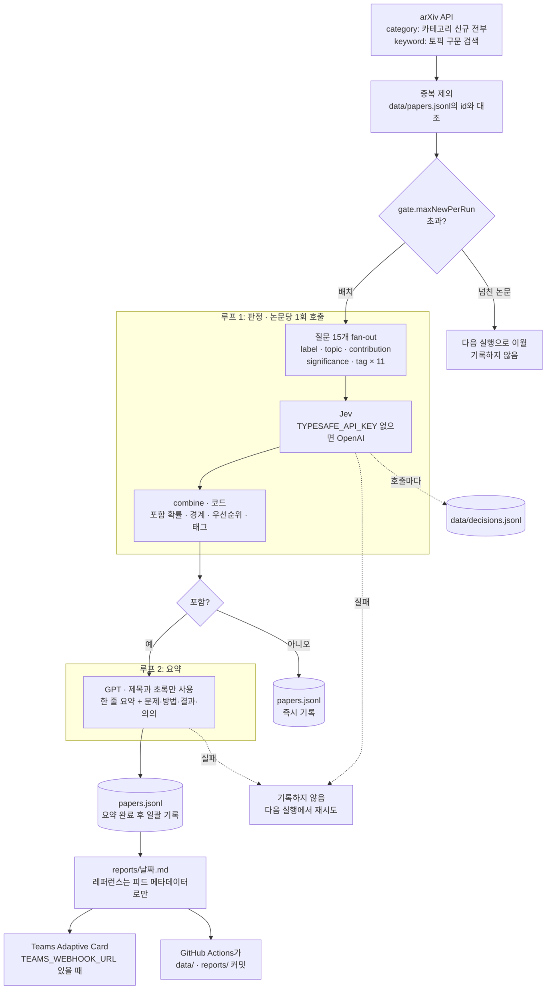

# trend-finder

관심 연구 주제의 신규 논문을 매일 찾아서, 관련도 판정을 거친 것만 요약해 리포트로 남기는 작은 파이프라인입니다. 기본 설정은 world model, physical AI, NVIDIA Cosmos입니다.

```
arXiv 수집 → 이미 본 논문 제외 → 루프 1: 판정(Jev) → 루프 2: 요약(GPT) → reports/<날짜>.md + Teams 카드
```

판정은 TypeSafe의 Jev가 합니다. Jev는 텍스트를 생성하지 않고, 타입이 정해진 질문에 확률이 붙은 답만 돌려주는 모델입니다. 빠르고 싸서 하루 수백 건을 전부 판정하는 데 맞습니다. GPT는 글을 쓰는 일(요약)만 맡습니다. Jev가 확신하지 못한 논문은 다른 모델에 다시 묻지 않고 리포트에 "경계"로 표시해서 읽는 사람이 판단합니다.

기본 수집 방식은 키워드 검색이 아닙니다. 지정한 arXiv 카테고리의 신규 논문을 전부 받아 온 뒤 루프 1이 초록을 읽고 고릅니다. 그래서 설정한 구문을 쓰지 않은 논문도 잡힙니다.

서버와 DB가 없습니다. GitHub Actions가 하루 한 번 실행하고, 상태는 `data/*.jsonl`로 레포에 커밋됩니다.

## 처리 흐름



읽는 순서대로 세 가지만 기억하면 됩니다. 판정 로그는 호출마다 남고, 탈락 논문은 판정 즉시 기록되며, 리포트 대상 논문은 요약이 다 끝난 뒤 게시 전에 한꺼번에 기록됩니다. 실패한 논문은 어디에도 기록되지 않아 다음 실행이 다시 시도합니다.

## 내 레포에서 돌리기

1. 이 레포를 fork하거나 템플릿으로 복사합니다.
2. **Actions 탭에서 워크플로를 활성화합니다.** fork한 레포는 예약 워크플로가 기본으로 꺼져 있습니다.
3. Settings → Secrets and variables → Actions에 등록합니다.
   - Secret `OPENAI_API_KEY` (필수. 요약에 씁니다)
   - Secret `TYPESAFE_API_KEY` (권장. 있으면 루프 1이 Jev로 돌고, 없으면 OpenAI로 대신합니다)
   - Secret `TEAMS_WEBHOOK_URL` (선택. 없으면 마크다운 리포트만 남깁니다)
   - Variable `FINDER_JEV_MODEL`, `FINDER_DECIDE_MODEL`, `FINDER_ESCALATE_MODEL`, `FINDER_SUMMARY_MODEL` (선택. 모델 교체용)
   - `REPORT_BASE_URL` (선택. Teams 카드의 "Full report" 링크 기준 URL. Actions 안에서는 레포 주소에서 자동으로 만들어지므로 로컬에서 Teams까지 테스트할 때만 필요합니다)
4. `finder.config.ts`에서 주제, 태그, 관심사 설명을 자기 것으로 바꿉니다.
5. Actions 탭에서 `daily-finder`를 수동 실행(Run workflow)해 확인합니다.

Teams 웹훅은 채널의 Workflows 앱에서 "Send webhook alerts to a channel" 템플릿으로 만듭니다. 예전 Office 365 커넥터 웹훅은 종료되어 쓸 수 없습니다. 웹훅 URL은 그 자체가 비밀 값이므로 코드나 로그에 남기지 마세요.

## 로컬 실행

Node 24 LTS 이상과 pnpm이 필요합니다. 빌드 단계는 없습니다. Node가 `.ts`를 직접 실행하고, TypeScript 7은 타입 검사에만 씁니다.

```bash
pnpm install
pnpm dry-run                              # 수집과 중복 제거만. LLM 호출·파일 쓰기·게시 없음
cp .env.example .env                      # 키 입력
node --env-file=.env src/cli.ts run       # 전체 실행
pnpm typecheck && pnpm test
```

SSL 검사를 하는 사내 프록시 뒤에서는 `NODE_EXTRA_CA_CERTS`에 사내 CA 인증서 경로를 지정하세요.

종료 코드는 세 가지입니다. Actions 실행 목록에서 빨간색이면 아래 중 하나입니다.

| 코드 | 뜻 |
| --- | --- |
| 0 | 정상. 통과한 논문이 없는 날도 0입니다 |
| 1 | 상태는 저장했지만 Teams 게시가 실패했거나, 판정을 시도한 논문이 전부 실패했습니다 |
| 2 | 사용법 오류이거나 `OPENAI_API_KEY`가 없습니다 |

`pnpm test`는 Node 내장 테스트 러너로 돕니다. 외부 호출 없이 arXiv 응답 픽스처(`test/fixtures/arxiv-feed.xml`)와 가짜 백엔드로 파이프라인 전체(판정 → 요약 → 저장 → 다음 실행에서 중복 제외), `combine()`의 임계값·가중치 계산, Jev SDK 요청·응답 변환을 확인합니다.

## CI

`.github/workflows/ci.yml`이 PR과 `main` push마다 `pnpm typecheck`와 `pnpm test`를 돌립니다. `daily-finder`가 커밋하는 `data/`와 `reports/` 변경은 CI를 건너뜁니다. 하루 한 번 실행하는 쪽은 `.github/workflows/daily-finder.yml`이고, 평일 11:17 KST(arXiv 발표 직후)에 돕니다.

## 루프 1: 작은 질문 여러 개를 한 번에

논문 한 편당 Jev를 한 번 호출하고, 그 호출에 질문 15개를 함께 실어 보냅니다(fan-out). Jev는 출력 토큰이 무료이고 질문들을 병렬로 답하므로, 질문을 쪼개도 비용과 시간이 거의 늘지 않습니다. 대신 답마다 확률이 따로 붙어서 각각 임계값을 걸고 평가할 수 있습니다.

| 질문 | 타입 | 쓰임 |
| --- | --- | --- |
| `label` | choice: core / adjacent / irrelevant | 리포트 포함 여부와 "경계" 표시 |
| `topic` | choice: 설정의 토픽 + none | 리포트 섹션 |
| `contribution` | choice: method / model-release / dataset-benchmark / survey / application / analysis | 리포트 표기 |
| `significance` | score: 4단계 | 우선순위 |
| `tag:<키>` × 태그 수 | noul (예/아니오 확률) | 확률이 `gate.tagThreshold` 이상이면 태그 부여 |

**판정을 종합하는 단계는 모델이 아니라 코드입니다** (`combine()` in `src/loops/triage.ts`). TypeSafe 문서가 권하는 방식(composite scoring)이기도 합니다. 가중치가 눈에 보이고, 결과가 마음에 안 들면 프롬프트가 아니라 숫자를 고치면 됩니다. Jev는 숫자 비교와 여러 단계를 거치는 추론에 약하다고 문서에 명시되어 있어서, 앞선 판정 결과를 다시 Jev에 넣어 종합시키는 구조는 피했습니다.

- **포함 여부**: `label`의 확률 분포에서 `gate.include` 라벨들의 확률을 더한 값이 `gate.includeThreshold`(0.5) 이상이면 포함합니다. 1등 라벨만 보지 않으므로, core 0.3 · adjacent 0.3 · irrelevant 0.4처럼 갈린 논문도 놓치지 않습니다. 이 값은 `papers.jsonl`의 `includeProbability`로 남아서, 나중에 다른 임계값을 적용했으면 어땠을지 다시 계산할 수 있습니다.
- **경계 표시**: 포함됐지만 `label`의 confidence가 `gate.borderlineBelow`(0.7)보다 낮으면 리포트에 "경계(직접 판단 필요)"로 표시합니다.
- **우선순위**: 기대 관련도(core 1, adjacent 0.5를 확률로 가중)와 정규화한 significance를 `gate.priorityWeights`로 가중 평균합니다.

**확신이 낮은 논문을 GPT로 재판정하지 않습니다.** Jev의 "잘 모르겠다"는 확률 분포에서 나온 보정된 신호인데, 재판정은 그것을 GPT가 스스로 적어낸 숫자로 덮어씁니다. 판정자가 둘이 되면 쌓이는 데이터의 기준도 섞입니다. 오판정 비용이 낮은 작업이라 마지막 판단은 읽는 사람에게 맡겼습니다. 두 백엔드를 나란히 비교하는 실험을 할 때만 `gate.escalate: true`로 켜세요. 그러면 경계 논문에 같은 질문을 GPT에도 묻고, 두 호출이 같은 `inputHash`로 `decisions.jsonl`에 남습니다.

질문 문구는 `finder.config.ts`에서 나옵니다. `interest`, 토픽의 `description`, 태그의 서술문이 그대로 질문이 됩니다. Jev는 "의도한 질문이 아니라 적힌 질문에 답한다"고 문서에 나와 있으니, 판정이 이상하면 이 문구부터 고치세요.

## 수집 모드

`finder.config.ts`의 `arxiv.mode`로 고릅니다.

| 모드 | 수집 대상 | 게이트 호출 수 | 약점 |
| --- | --- | --- | --- |
| `category` (기본) | 카테고리의 수집 창 안 신규 논문 전부 | 하루 수백 건 | 판단 모델 비용이 호출 수에 비례 |
| `keyword` | 토픽 구문이 제목·초록에 있는 논문만 | 하루 수십 건 | 구문을 안 쓴 논문과 새 용어를 놓침 |

`category` 모드에서도 각 논문이 키워드 검색에 걸렸을지를 로컬에서 계산해 `matchedTopics`에 남깁니다. 리포트 첫 줄의 "키워드 검색이었다면 놓쳤을 논문 N건"과 논문별 "키워드 미매칭" 표시가 이 값입니다. 이 숫자가 계속 0에 가까우면 `keyword` 모드로 돌아가도 잃는 게 없다는 뜻입니다.

비용 상한은 `gate.maxNewPerRun`입니다. 한 실행에서 판정하는 신규 논문 수를 제한하고, 넘친 논문은 최신순으로 밀려 다음 실행에서 처리됩니다. 첫 실행은 수집 창 전체(기본 4일 치)를 한꺼번에 보므로 따라잡는 데 2~3회가 걸릴 수 있습니다.

## 구조

| 경로 | 역할 |
| --- | --- |
| `finder.config.ts` | 주제·태그·게이트 기준·모델·리포트 언어. 보통 이 파일만 고칩니다 |
| `src/config.ts` | 위 설정의 타입과 각 항목의 뜻(주석). `FINDER_*_MODEL` 환경 변수 덮어쓰기 |
| `src/cli.ts` | 진입점. 키 유무에 따라 백엔드를 고르고 `run`을 호출한 뒤 종료 코드를 정합니다 |
| `src/pipeline.ts` | 한 번의 실행 전체: 수집 → 중복 제외 → 비용 상한 → 루프 1·2(동시 실행) → 저장 → 리포트 → 게시 |
| `src/store.ts` | `data/*.jsonl` 읽기·쓰기. 동시 append를 직렬화하고, 깨진 마지막 줄은 경고만 내고 건너뜁니다 |
| `src/types.ts` | `Paper`, 판정 결과, 저장 레코드의 타입 |
| `src/util.ts` | 동시 실행 제한(`mapLimit`), 타임존 날짜, 해시 |
| `src/sources/arxiv.ts` | arXiv API 수집. 카테고리 전체 페이지네이션 또는 주제별 키워드 쿼리, 요청 간 3초 간격 |
| `src/llm/backend.ts` | `DecisionBackend`(choice·noul·score 질문에 답하는 `ask()`)와 `TextBackend`(글쓰기) 인터페이스 |
| `src/llm/jev.ts` | `DecisionBackend`의 Jev 구현 (`@typesafe-ai/sdk`) |
| `src/llm/openai.ts` | 같은 질문 형식을 structured output으로 흉내 내는 OpenAI 구현, 그리고 글쓰기 구현 |
| `src/loops/triage.ts` | 루프 1: 질문 구성, 코드에서의 종합(`combine`), 판단 로그, 선택적 재판정 |
| `src/paper.ts` | 모델에 보여줄 논문 표현. 판단에 필요한 제목·카테고리·초록만 넘깁니다 |
| `src/loops/summarize.ts` | 루프 2: 요약. 제목과 초록에 있는 내용만 사용 |
| `src/report.ts` | 마크다운 리포트. **레퍼런스는 피드 메타데이터로만 만들고 LLM이 쓰지 않습니다** |
| `src/sinks/teams.ts` | Adaptive Card 게시. 페이로드 크기 제한에 맞춰 항목 수를 줄입니다 |
| `data/papers.jsonl` | 지금까지 본 논문과 판정 결과. 중복 방지와 트렌드 집계의 원천. 탈락한 논문은 id·라벨·confidence·포함 확률만 남깁니다 |
| `data/decisions.jsonl` | 모든 판단 호출의 로그(백엔드, 모델, 입력 해시, 질문별 답과 확실성, 입력 토큰) |
| `reports/<날짜>.md` | 그날의 마크다운 리포트. 통과한 논문이 없는 날은 파일을 만들지 않습니다 |
| `test/` | 파이프라인·판정·arXiv 파서 테스트와 피드 픽스처 |

## 리포트 형식

논문은 게이트가 고른 토픽 섹션 아래 우선순위 순으로 한 번씩만 실립니다. 토픽이 `none`이면 키워드가 매칭된 첫 토픽, 그것도 없으면 "기타"입니다. 각 논문은 메타데이터 한 줄, 한 줄 요약, 문제·방법·결과·의의 한 문단으로 구성되고, 레퍼런스 번호는 문서 끝 References 목록을 가리킵니다.

```markdown
# 리서치 트렌드 리포트 · 2026-09-21

수집 412건 · 신규 388건 · 리포트 대상 7건 · 그중 키워드 검색이었다면 놓쳤을 논문 2건

## World Models

### <논문 제목> [1]

A. Kim, B. Lee, C. Park et al. · 2026-09-19 · [arXiv:2609.01234](…) · core (0.91) · method · priority 0.82 · world-model, video-generation

**한 줄 요약**

문제. 방법. 결과. 왜 중요한가.

## References

1. A. Kim, B. Lee, C. Park et al. "<논문 제목>." arXiv:2609.01234 (2026-09-19). https://arxiv.org/abs/2609.01234
```

리포트 언어는 `report.language`로 정하고, 현재 제목·통계 줄 등 고정 문구는 한국어와 영어(그 외 값)만 있습니다. 다른 언어를 쓰려면 `src/report.ts`의 `LABELS`에 항목을 추가하세요. 요약 본문은 모델이 설정한 언어로 씁니다.

## 동작 원칙

- **같은 논문은 한 번만 처리합니다.** 키는 버전을 뗀 arXiv id입니다. 수집 창(`lookbackDays`)이 겹쳐도 안전하므로, 실행이 하루 빠져도 다음 실행이 메웁니다.
- **실패한 논문은 본 것으로 기록하지 않습니다.** 다음 실행에서 다시 시도합니다.
- **탈락한 논문은 판정 즉시 기록합니다.** 실행이 중간에 죽어도 이미 판정한 수백 건을 다시 판정하지 않습니다. 리포트 대상 논문은 요약이 모두 끝난 뒤 한꺼번에 기록합니다. 리포트에 실리지 못한 논문이 "보고됨"으로 남는 일을 막기 위해서입니다.
- **수집이 중간에 끊기면 조용히 넘어가지 않고 실행을 실패시킵니다.** arXiv API는 결과 중간에 빈 페이지를 돌려줄 때가 있습니다. 3회 재시도 후에도 비어 있으면 오류로 끝내고, 다음 실행이 같은 창을 다시 받습니다.
- **상태를 먼저 저장하고 나서 게시합니다.** Teams 게시가 실패해도 같은 논문이 내일 다시 올라가지 않습니다. 이 경우 실행은 실패(빨간색)로 표시되고 리포트 파일은 남습니다.
- **통과한 논문이 없는 날은 게시하지 않습니다.**

## 백엔드 비교 실험

`data/decisions.jsonl`에는 호출 한 번이 한 줄로 남습니다. `answers`는 질문 이름마다 `[값, 확실성]`이고, 확실성은 choice·score면 confidence, noul이면 "예"일 확률입니다.

```json
{"loop":"triage","subjectId":"2609.01234","backend":"jev","model":"jev-1.13.0","inputHash":"…",
 "answers":{"label":["core",0.91],"topic":["world-model",0.84],"significance":[1.6,0.55],"tag:vla":[false,0.08]},
 "inputTokens":812}
```

두 백엔드의 숫자는 같은 뜻이 아닙니다. Jev의 confidence는 모델의 확률 분포에서 계산된 값이고, OpenAI 쪽은 모델이 스스로 적어낸 숫자입니다. 같은 임계값으로 둘을 다루기 전에 직접 재보세요. 논문 100~200건에 정답 라벨을 달고 아래처럼 조인하면 백엔드별 정확도와 confidence 구간별 실제 정답률이 나옵니다. `gate.escalate`를 켜고 돌린 기간에는 경계 논문마다 같은 `inputHash`로 두 백엔드의 답이 나란히 남으므로 바로 비교할 수 있습니다.

```sql
-- DuckDB 예시: 백엔드별, label과 그 confidence 구간별 건수
SELECT backend, model,
       answers->>'$.label[0]' AS label,
       round(CAST(answers->>'$.label[1]' AS DOUBLE), 1) AS confidence_bucket,
       count(*) AS n
FROM read_json('data/decisions.jsonl', format='newline_delimited',
               columns={loop:'VARCHAR', backend:'VARCHAR', model:'VARCHAR', answers:'JSON'})
WHERE loop = 'triage'
GROUP BY ALL ORDER BY ALL;
```

## 알려진 제약

- `category` 모드에서는 `data/` 파일이 하루 수백 줄씩 늡니다. 대략 하루 200KB, 1년에 수십 MB 수준입니다. 판단 로그를 끄는 설정은 아직 없습니다. 백엔드 비교 실험이 끝나 로그가 필요 없어지면 `src/pipeline.ts`의 `appendDecisions` 호출을 빼거나 `decisions.jsonl`의 오래된 줄을 잘라내세요.
- TypeScript 7.0에는 아직 안정된 프로그래밍 API가 없어 typescript-eslint를 쓸 수 없습니다. 그래서 린터를 넣지 않았습니다.
- Teams 카드의 "Full report" 링크는 게시 직후 몇 초간 404일 수 있습니다. 리포트 커밋이 게시 다음 단계이기 때문입니다.
- 퍼블릭 레포는 60일간 활동이 없으면 GitHub가 예약 워크플로를 끕니다. 알림 메일이 오면 Actions 탭에서 다시 켜세요.
- 소스는 현재 arXiv 하나입니다. 블로그 RSS와 GitHub 릴리스는 `src/sources/`에 같은 형태(`Paper[]` 반환)로 추가하면 됩니다.

## License

MIT
